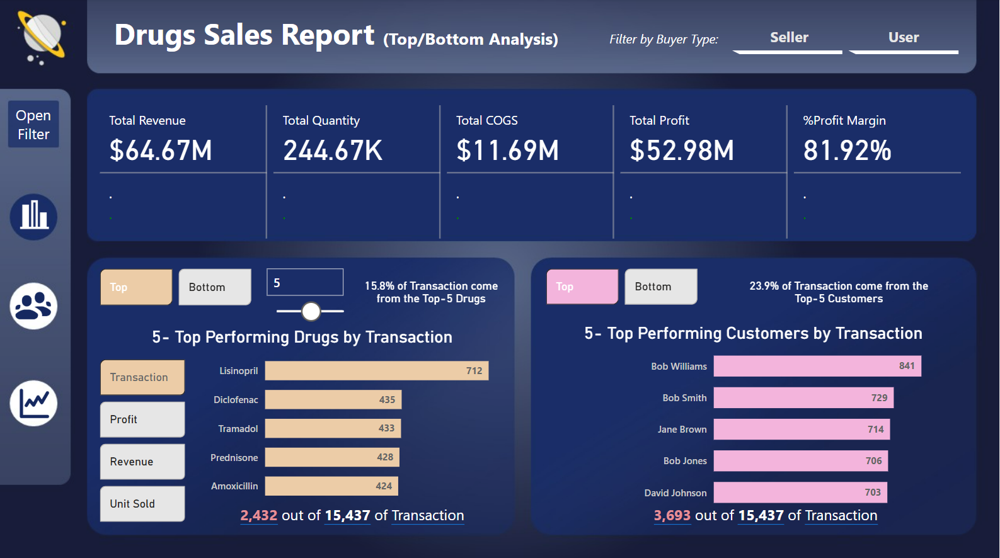
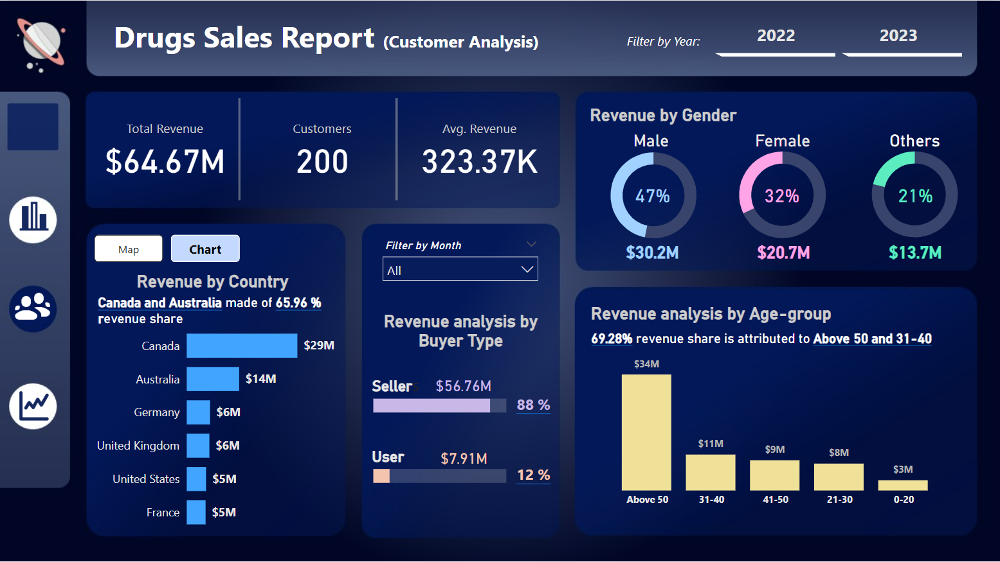
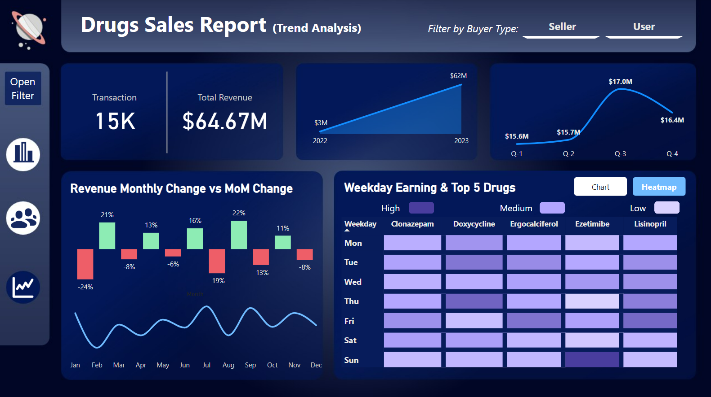

# Portfolio Case Study: Drug Sales Performance Analysis

---
## ✨ Introduction
This case study takes a deep dive into drug sales data from 2022 to 2023, focusing on customer segmentation, revenue trends, and product performance. A dashboard was developed to break down sales by demographics, countries, buyer types, and time periods-highlighting key patterns and insights to support strategic business decisions.

---
## 🔒 Problem Statements
1. Which drug products generate the most revenue, and how do customer types and demographics influence product performance?
2. Which customer segments are driving the most revenue, and how can we better understand our buyer profiles to improve targeting and sales strategy?
3. What are the key revenue trends over time, and how do seasonal or quarterly patterns affect overall drug sales performance?
---

## 📚 Data Sources
There are 3 datasets provided in CSV format, described as below:
- `fact_sales.csv` is a fact table that records individual drug sales transactions, which used for tracking and analyzing sales performance over time, across products, regions, and customer types
- `dim_drug.csv` is a dimension table containing detailed information about each drug in the dataset
- `dim_customers` is a dimension table containing demographic and identification information of customers
---

## ⚙️ Skills demonstrated
The following Power BI features were incorporated:
1. Bookmarking,
2. Measures, tables
3. Page navigation
4. Filters
5. Tooltips
6. Button
7. DAX 
8. Modelling: The project follows the star schema model, which has 2 dimension tables and 1 fact table. The dimension tables are all joined to the fact table with a one-to-many relationship.
---

## 🖼️ Visualization
The report consists of 3 following pages:
1. Top/Bottom Analysis
2. Customers Analysis
3. Trend Analysis

The report is available for interaction at the link provided

---

## 🏆 Results/Insights
### 1. Top/Bottom Analysis

- The profit margin stands at 81.92%, indicating outstanding profitability and strong financial performance.

- The top 5 drugs account for 2,432 out of 15,437 total transactions, representing approximately 15.8% of all sales activity. Even though top 5 drugs have the highest transaction counts, their limited share of overall sales reflects a broad and balanced product portfolio

- These five customers account for 3,693 out of 15,437 transactions, representing approximately 23.9% of total sales. Nearly 1 in 4 transactions come from just 5 customers, which suggests a strong dependency on a small portion of the customer base.

### 2. Customer Analysis

- Average revenue per customer is $323.37K, indicating high spending per customer is likely driven by large-volume purchases from sellers.

- Revenue is fairly distributed across gender groups, with male customers contributing the most at 47%. Notably, the "Others" category accounts for 21% of revenue, highlighting inclusivity and presenting a valuable opportunity to engage non-binary and diverse gender segments.

- Canada and Australia are generating approximately $29M and $14M in revenue, respectively. Combined, they account for around 66% of the total revenue, highlighting their strategic importance. Other significant contributors include Germany, the United Kingdom, the United States, and France, each bringing in approximately $5M–6M in revenue. Revenue by country points out the high dependency on Canada and Australia. On the one hand, Canada and Australia are two major markets. On the other hand, this overreliance could expose the business to heightened risks if conditions change in these countries.

- Revenue is heavily concentrated among sellers, who contribute $56.76M (88%), compared to $7.91M (12%) from end users. This indicates a strong B2B focus, but also highlights a potential vulnerability, as reliance on a few large accounts may impact revenue stability if key clients are lost or scale back purchases.

- Older age groups dominate revenue contributions, with individuals over 50 and those aged 31–40 collectively generating nearly 70% of total sales. This points to a significant demand among more mature customers.

### 3. Trend Analysis

- Year-over-year revenue saw an exponential increase from $3M in 2022 to $62M in 2023, marking a growth of nearly 1967%. This sharp rise suggests a major business breakthrough, potentially driven by market expansion, new product launches, or high-value contract acquisitions.

- Quarterly revenue remained relatively stable, ranging from $15.6M to $17M, with Q3 being the peak. This consistent performance suggests balanced sales throughout the year, while the Q3 spike may reflect seasonal factors such as back-to-school demand, flu season, or insurance-related cycles.

- Monthly revenue trends show the highest growth in August (+22%), February (+21%), and April (+13%), while the sharpest declines occurred in January (-24%) and July (-19%). These patterns suggest that strong rebounds often follow slow months, likely driven by seasonal purchasing habits or budget resets.

- Sales activity remains consistently high during weekdays, particularly for Clonazepam, Doxycycline, Ergocalciferol, Ezetimibe, and Lisinopril. This trend suggests a clinical or institutional purchasing pattern, with stronger sales from Monday to Friday, indicating that these drugs are essential components in standard treatment protocols.
---

## 📌 Business Recommendations
**1. Expand Market Reach**
- Launch tailored campaigns using competitive pricing, local partnerships, and alignment with regional regulations.
- Conduct market entry and penetration studies in key regions like the US and Europe.

**2. Personalized Marketing Strategies**
- Design marketing campaigns by gender personas, focusing on personalized healthcare solutions.
- 50+ Segment: Offer chronic care programs, subscription models, and medication adherence packages.
- 21–40 Segment: Promote preventive care, mental wellness, and fitness-related supplements.

**3. Strengthen Direct-to-Consumer (D2C) Channels**
- Launch a VIP or tiered loyalty program to encourage repeat purchases and customer loyalty.
- Expand retail networks and online consumer platforms.
- Acquire and nurture mid-sized customers to reduce reliance on a few major accounts and improve revenue stability.

**4. Align with Seasonal Trends**
- Plan major marketing and sales efforts around February, April, and August (high-growth months).
- Investigate and address revenue dips in January and July with bundled offers or incentives.

**5.Optimize B2B Engagement**
- Offer weekday discounts or bulk purchase packages for institutional buyers.
- Assign dedicated account managers to strengthen relationships with key clients.

**6. Operational Improvements**
- Use weekday heatmap insights to optimize inventory management and staffing schedules.
- Audit low-performing drugs to eliminate products with low demand and poor margins.
- Increase marketing investment for top-selling drugs to maximize sales volume.

## ⚒️ Tools & Technologies
### Power BI
